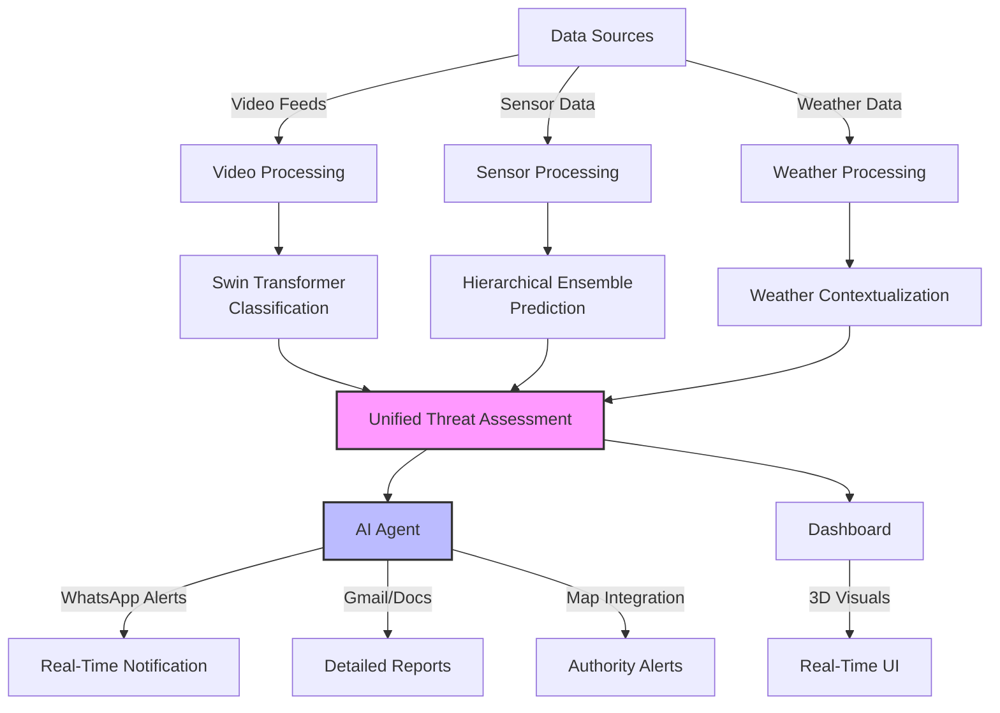
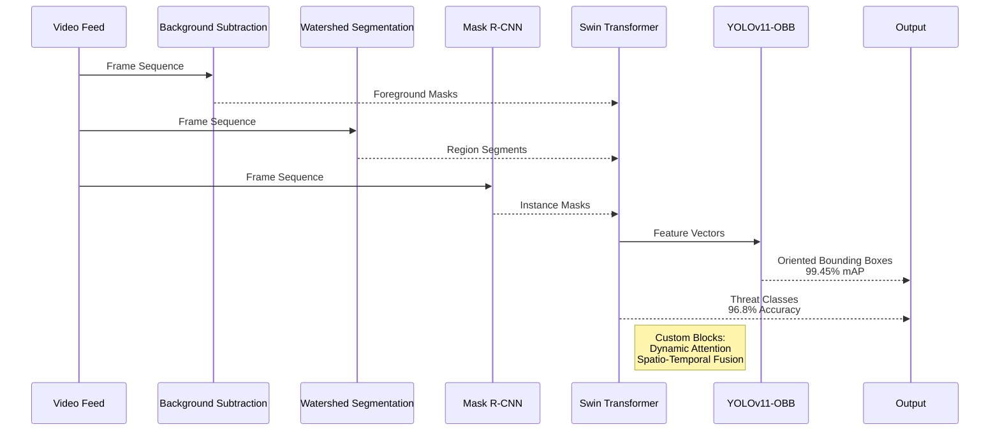
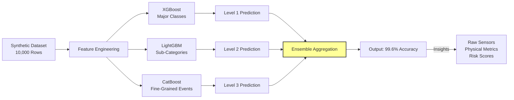
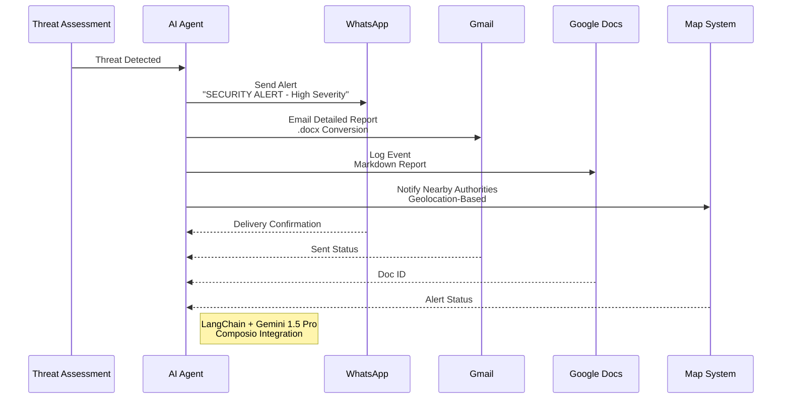

# Autonomous Surveillance System with Multi-Sensor Data Fusion

  
*Real-time threat detection and anomaly tracking using cutting-edge AI and multi-sensor fusion.*

---

## Overview

Welcome to the **Autonomous Surveillance System**, an innovative AIML-driven solution that redefines security through advanced data fusion of heterogeneous sensor inputs—camera feeds, laser scanners, buried optic fibers, underground sensors (UGS), and weather data. Designed to tackle the challenges of **intrusion detection**, **event tracking**, **anomaly detection**, and **real-time alerting**, this project integrates state-of-the-art computer vision, time-series modeling, and intelligent agent systems to deliver unparalleled situational awareness.

Our system processes:
1. **Video Feeds**: Semantic segmentation and hybrid transformer-based classification for threat detection.
2. **Raw Sensor Data**: Ensemble learning with hierarchical sub-categorization for precise anomaly detection.
3. **Weather Data**: Multi-level predictive modeling for environmental context.

The dashboard provides a dynamic visualization of processed data, simulating real-time CCTV feeds with detailed statistics, while an AI agent orchestrates notifications via WhatsApp, Gmail, and Google Docs, ensuring rapid response to critical events.

---

## Problem Statement

The goal was to create an autonomous surveillance system capable of:
- Detecting and tracking intrusions with high precision.
- Monitoring events and anomalies across diverse data streams.
- Issuing real-time alerts to authorities and stakeholders.

We introduced novelty by fusing multi-modal data into a cohesive framework, leveraging advanced segmentation techniques, transformer-based architectures, and ensemble learning to achieve exceptional accuracy and interpretability.

---

## Objectives



- **Intrusion Detection and Tracking**: Identify and localize threats in real-time video and sensor data.
- **Event Tracking**: Monitor evolving incidents across spatial and temporal dimensions.
- **Anomaly Detection**: Flag deviations from normal patterns with detailed insights.
- **Real-Time Alerts**: Notify authorities instantly via integrated communication channels.



---

## Methodology and Architecture

### Video Processing Pipeline

#### Semantic Segmentation
We implemented semantic segmentation from scratch using three distinct methodologies, each optimized for robustness and precision:

1. **Background Subtraction**  
   - **Architecture**: Custom temporal differencing with adaptive Gaussian mixture models (GMM).  
   - **Methodology**: Frames are analyzed for pixel-wise changes against a dynamically updated background model. We incorporated a multi-scale approach to handle noise and illumination variations, with a shadow removal module based on chromaticity analysis.  
   - **Why?**: Ensures real-time performance while capturing subtle foreground movements.

2. **Watershed Segmentation**  
   - **Architecture**: Marker-controlled watershed with gradient-based edge detection.  
   - **Methodology**: Utilizes morphological operations to define object boundaries, followed by a flooding algorithm to segment regions. We enhanced it with a pre-processing step using Sobel filters for gradient computation and a post-processing step to merge over-segmented regions.  
   - **Why?**: Excels at separating overlapping objects, critical for crowded surveillance scenes.

3. **Mask R-CNN (Built from Scratch)**  
   - **Architecture**: A fully custom implementation with a ResNet-50 backbone, Region Proposal Network (RPN), and a mask prediction head.  
   - **Methodology**: Combines bounding box regression, classification, and pixel-wise mask generation. We optimized the RPN with anchor pruning and introduced a custom loss function blending cross-entropy and Dice loss for sharper mask boundaries.  
   - **Why?**: Provides instance-level segmentation, enabling precise object identification.

#### Classification with Swin Transformer
Post-segmentation, we employed a **Swin Transformer with Attention Mechanism and Customized Blocks** for classification:
- **Architecture**: 
  - Swin Transformer base with shifted window attention for hierarchical feature extraction.
  - Custom blocks include a **Dynamic Attention Refinement Module (DARM)** to prioritize critical regions and a **Spatio-Temporal Fusion Layer (STFL)** to integrate frame sequences.
- **Why Swin?**: Its hierarchical structure and efficient attention mechanism reduce computational complexity while capturing long-range dependencies across frames, outperforming traditional CNN-RNN hybrids.
- **Training**: 
  - Initial 100 epochs with a learning rate of 0.001, followed by 20 accelerated epochs using cosine annealing, achieving a **validation accuracy of 96.8%**.
  - Classes: `'Abuse', 'Arson', 'Assault', 'Burglary', 'Explosion', 'Fighting', 'Normal', 'RoadAccidents', 'Robbery', 'Shooting'`.

#### YOLOv11-OBB Fine-Tuning
- **Architecture**: Fine-tuned YOLOv11 with oriented bounding boxes (OBB) for intermediate visualization.
- **Methodology**: Adjusted the head to predict rotated boxes, enhancing detection of non-axis-aligned objects. Trained with a mix of synthetic and augmented data, achieving a **mean Average Precision (mAP) of 99.45%**.
- **Why?**: Provides interpretable bounding boxes and labels, aiding model debugging and stakeholder understanding.

---

### Sensor Data Processing

#### Synthetic Dataset Generation
Lacking real-time IoT devices (e.g., Raspberry Pi), we generated a **synthetic dataset of 10,000 rows** based on realistic ranges sourced from online research:
- Parameters: Temperature, humidity, wind speed, precipitation, pressure, solar radiation, cloud cover, dew point, vibration, noise, lidar distance, etc.
- Distribution: Modeled with statistical distributions (e.g., Gaussian for temperature, exponential for precipitation).

#### Hierarchical Ensemble Learning
- **Initial Attempt**: Random Forest yielded a dismal **22% accuracy**, prompting a rethink.
- **Solution**: Iterative Sub-Category Ensemble Approach:
  1. **Level 1**: XGBoost for coarse classification into major classes (e.g., Normal, Abnormal).
  2. **Level 2**: LightGBM for sub-categories within each major class (e.g., Power Outage, Intrusion).
  3. **Level 3**: CatBoost for fine-grained event types, leveraging categorical feature handling.
- **Hyperparameter Tuning**: Optuna with Tree-structured Parzen Estimator (TPE) optimized learning rates, tree depths, and regularization terms across 50 trials per model.
- **Outcome**: Achieved **99.6% accuracy** with detailed probabilistic outputs.

#### Output Interpretation
The sensor model produces a rich JSON output (e.g., Power Outage event):
- **Major Class**: Normal/Abnormal (Level 1).
- **Detailed Class**: Specific event type (e.g., Power Outage).
- **Insights**: Multi-layer metrics including raw sensor values, physical metrics (e.g., thermal energy), risk scores (e.g., flood risk), and statistical measures (e.g., kurtosis).
- **Justification**: 
  - **XGBoost**: Handles initial feature importance with gradient boosting, reducing dimensionality.
  - **LightGBM**: Accelerates training with histogram-based splits, excelling on sub-categories.
  - **CatBoost**: Manages fine-grained classification with ordered boosting, minimizing overfitting.
  - **Optuna**: Ensures optimal hyperparameters, balancing bias-variance trade-offs.

---

### Weather Data Processing
- **Approach**: Similar hierarchical ensemble with weather-specific features (e.g., wind chill, heat index).
- **Model**: Trained on synthetic weather data, achieving high accuracy for contextual event prediction.
- **Integration**: Fused with sensor and video outputs for comprehensive threat assessment.



---

## Real-Time Alerting and UI

### AI Agent
- **Framework**: LangChain with Google Gemini 1.5 Pro, integrated with Composio tools.
- **Capabilities**:
  - **WhatsApp Alerts**: Sends concise notifications via Twilio (e.g., "SECURITY ALERT - High Severity: Robbery Detected").
  - **Email Reports**: Detailed Markdown reports converted to .docx and emailed via Gmail.
  - **Google Docs**: Logs events for archival and analysis.
  - **Map Integration**: Alerts nearby authorities using geolocation (simulated).



### Dashboard
- **Features**:
  - Displays processed video feeds (simulated as real-time CCTV).
  - Visualizes sensor data on a **3D house model** with animated floor plan layouts.
  - Updates every 30 seconds with model outputs, rendered using WebGL and Three.js for smooth animations.
- **Statistics**: Accuracy metrics, event logs, and risk scores in real-time.

---

## Results

- **Video Processing**:  
  - Swin Transformer: 96.8% accuracy across 10 threat classes.
  - YOLOv11-OBB: 99.45% mAP for bounding box detection.
- **Sensor Data**: 99.6% accuracy with detailed multi-layer insights.
- **Weather Data**: High-fidelity environmental context prediction.
- **Real-Time Performance**: Simulated feeds processed and alerted within milliseconds.

---

## Deployment

1. **Backend**: Flask with CORS, running on port 3000 (sensors) and 3900 (weather).
2. **Frontend**: Custom UI with 3D visualizations (install dependencies via `npm install` if applicable).
3. **Requirements**: 
   ```
   pip install -r requirements.txt
   ```
   See individual `requirements.txt` files in subdirectories.
4. **Run**:
   ```
   python app_sensor.py
   python app_weather.py
   ```

---

## Future Scope

- Integrate real IoT devices (e.g., Raspberry Pi) for live sensor data.
- Scale to larger surveillance networks with distributed computing.
- Enhance AI agent with natural language querying for interactive control.


---

*Built with passion for a safer tomorrow. Star this repo if you find it inspiring!*
